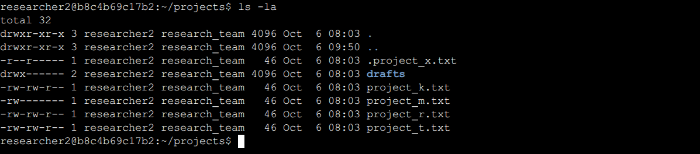

# File Permissions in Linux

## Project description

In this project, I examined and modified Linux file and directory permissions for a research team to ensure the principle of least privilege. Using commands like `ls -la` and `chmod`, I inspected and removed unauthorized access to improve the security of sensitive research files.

---

## Modifying File and Directory Permissions

The project required updating permissions in the `/home/researcher2/projects` directory. The initial permissions were:


```text
drwx--x--- drafts
-rw-rw-rw- project_k.txt
-rw-r----- project_m.txt
-rw-rw-r-- project_r.txt
-rw-rw-r-- project_t.txt
-rw--w---- .project_x.txt
```

### Changes Applied

1. **`project_k.txt`**  
   Removed write permission from `other` users to prevent unauthorized modifications:
   ```bash
   chmod o-w project_k.txt
   ```
   *Final Permissions:* `-rw-rw-r--`

2. **`project_m.txt`**  
   Restricted access to only the owner by removing group read permissions:
   ```bash
   chmod g-r project_m.txt
   ```
   *Final Permissions:* `-rw-------`

3. **`.project_x.txt` (Hidden file)**  
   Removed write access from user and group, and added read access to the group for this archived file:
   ```bash
   chmod u-w,g-w,g+r .project_x.txt
   ```
   *Final Permissions:* `-r--r-----`

4. **`drafts` (Directory)**  
   Removed execute permission from the group to restrict directory access to the owner only:
   ```bash
   chmod g-x drafts
   ```
   *Final Permissions:* `drwx------`


---

## Verification

To verify the changes, I used the `ls -la` command:



The final permissions correctly matched the authorization requirements:

```text
drwx------ drafts
-rw-rw-r-- project_k.txt
-rw------- project_m.txt
-rw-rw-r-- project_r.txt
-rw-rw-r-- project_t.txt
-r--r----- .project_x.txt
```

---

## Summary

By reviewing and modifying permissions for specific files and directories using `chmod`, I successfully restricted access to authorized users and groups only. This process ensured compliance with the organization's security policies and protected sensitive research data.
