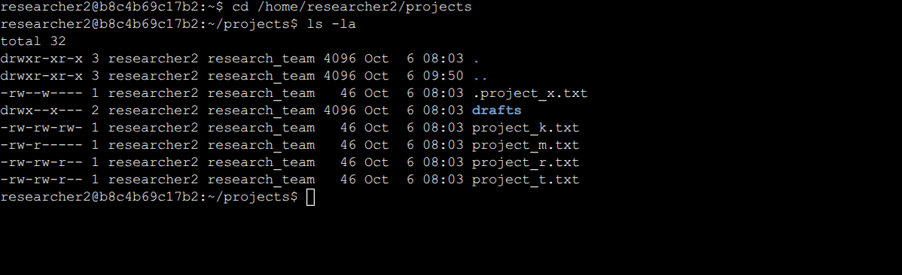

# File Permissions in Linux

## Project description

In this project, I examined and modified Linux file and directory permissions for a research team to ensure that users had only the access they were authorized to have. I used Linux commands such as `ls -la` to inspect permissions and `chmod` to remove unnecessary access. These changes helped enforce the principle of least privilege and improve the security of sensitive research files.

---

## Check file and directory details

First, I navigated to the `projects` directory:

```bash
cd /home/researcher2/projects
```

I then used the following command to display all files, including hidden files, along with their permissions:

```bash
ls -la
```



The `ls` command lists directory contents.

The options mean:

- `-l` displays detailed information such as permissions, owner, group, size, and modification date.
- `-a` displays all files, including hidden files.

A regular `ls -l` command does not normally display hidden files. In Linux, files and directories whose names begin with a period (`.`) are hidden.

For example:

```text
.project_x.txt
```

is a hidden file.

An example of the initial permissions is:

```text
drwx--x--- drafts
-rw-rw-rw- project_k.txt
-rw-r----- project_m.txt
-rw-rw-r-- project_r.txt
-rw-rw-r-- project_t.txt
-rw--w---- .project_x.txt
```

---

## Describe the permissions string

Linux represents permissions using a **10-character permission string**.

For example:

```text
-rw-rw-rw-
```

The first character identifies the file type:

```text
-
```

A hyphen means it is a regular file.

A directory instead begins with:

```text
d
```

For example:

```text
drwx--x---
```

The remaining nine characters are divided into three groups:

```text
-rw- rw- rw-
 │   │   │
 │   │   └── Other
 │   └────── Group
 └────────── User
```

Each group contains three possible permissions:

```text
r = read
w = write
x = execute
- = permission not granted
```

For example:

```text
-rw-rw-rw-
```

means:

```text
User:  read and write
Group: read and write
Other: read and write
```

The file `project_k.txt` initially had these permissions:

```text
-rw-rw-rw-
```

This meant that the owner, the group, and all other users could modify the file. Since users classified as `other` should not have write permission, this configuration needed to be changed.

---

## Change file permissions

Linux uses the `chmod` command to modify permissions.

The letters used with `chmod` include:

```text
u = user/owner
g = group
o = other
a = all users
```

Permissions include:

```text
r = read
w = write
x = execute
```

The operators include:

```text
+ = add permission
- = remove permission
= = assign exact permissions
```

### Modify project_k.txt

The initial permissions were:

```text
-rw-rw-rw-
```

The `other` users had write permission, which was not authorized.

I removed write permission from `other` with:

```bash
chmod o-w project_k.txt
```

Explanation:

```text
o = other users
- = remove
w = write permission
```

After the change, the file permissions became:

```text
-rw-rw-r--
```

Now:

```text
User:  read, write
Group: read, write
Other: read
```

The file can still be read by other users, but they can no longer modify it. This matches the lab requirement that files must not allow `other` users to write to them.

---

## Restrict project_m.txt

The original permissions for `project_m.txt` were:

```text
-rw-r-----
```

This means:

```text
User:  read, write
Group: read
Other: none
```

This file is restricted and should only be accessible by the owner.

The group therefore should not have read or write permission.

I used:

```bash
chmod g-r project_m.txt
```

This removes the group's read permission.

Because the group did not already have write permission, the final permissions become:

```text
-rw-------
```

The result is:

```text
User:  read, write
Group: none
Other: none
```

An alternative command that explicitly removes both group read and write permissions is:

```bash
chmod g-rw project_m.txt
```

The official lab specifically requires the group to have neither read nor write access to this restricted file.

---

## Change permissions on a hidden file

The directory also contained the hidden file:

```text
.project_x.txt
```

Files beginning with a period are hidden in Linux.

A regular command such as:

```bash
ls -l
```

might not display this file.

To include hidden files, I used:

```bash
ls -la
```

The initial permissions were:

```text
-rw--w----
```

This means:

```text
User:  read, write
Group: write
Other: none
```

The file had been archived, so nobody should be able to modify it. However, both the user and group should still be able to read it.

I changed the permissions using:

```bash
chmod u-w,g-w,g+r .project_x.txt
```

This command performs three changes:

```text
u-w = remove write permission from the user
g-w = remove write permission from the group
g+r = add read permission to the group
```

The final permissions become:

```text
-r--r-----
```

This means:

```text
User:  read
Group: read
Other: none
```

The file can now be read by the owner and research group but cannot be modified by either. This is the intended configuration for the archived hidden file.

---

## Change directory permissions

The `projects` directory also contains the following subdirectory:

```text
drafts
```

Its initial permissions were:

```text
drwx--x---
```

Breaking this down:

```text
d    = directory
rwx  = user can read, write, and access the directory
--x  = group can access the directory
---  = other users have no permissions
```

Only the `researcher2` user should be able to access the `drafts` directory and its contents.

Therefore, the group should not have execute permission.

I used:

```bash
chmod g-x drafts
```

Explanation:

```text
g = group
- = remove
x = execute/access permission
```

The final permissions become:

```text
drwx------
```

Now only the owner can read, modify, and access the directory.

For directories, the execute (`x`) permission is especially important because it allows a user to enter or traverse the directory. Removing `x` from the group prevents members of the group from accessing files through that directory. The official lab specifies removing the group's execute permission from `drafts`.

---

## Verify the permission changes

After making the changes, I verified the permissions again using:

```bash
ls -la
```

The expected permissions are approximately:

```text
drwx------ drafts
-rw-rw-r-- project_k.txt
-rw------- project_m.txt
-rw-rw-r-- project_r.txt
-rw-rw-r-- project_t.txt
-r--r----- .project_x.txt
```

No modifications were needed for:

```text
project_r.txt
project_t.txt
```

Their existing permissions already met the authorization requirements.

The complete sequence of commands used was:

```bash
cd /home/researcher2/projects

ls -la

chmod o-w project_k.txt

chmod g-r project_m.txt

chmod u-w,g-w,g+r .project_x.txt

chmod g-x drafts

ls -la
```

The final `ls -la` command confirms that all required authorization changes were successfully applied.

---

## Summary

I reviewed Linux file and directory permissions to identify access that did not match the organization's authorization requirements. I used `chmod` to remove unauthorized write, read, and execute permissions from files and directories, including a hidden archived file. Finally, I verified the changes using `ls -la`, ensuring that only the appropriate users and groups retained access. These changes reduced unnecessary privileges and helped protect the research team's files from unauthorized modification or access.
